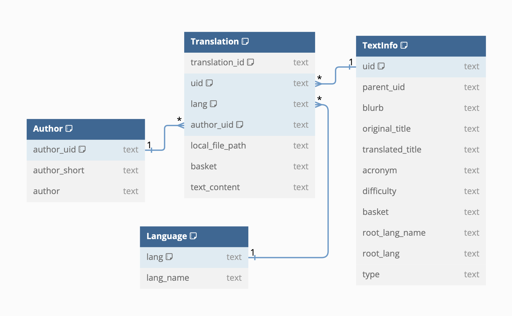
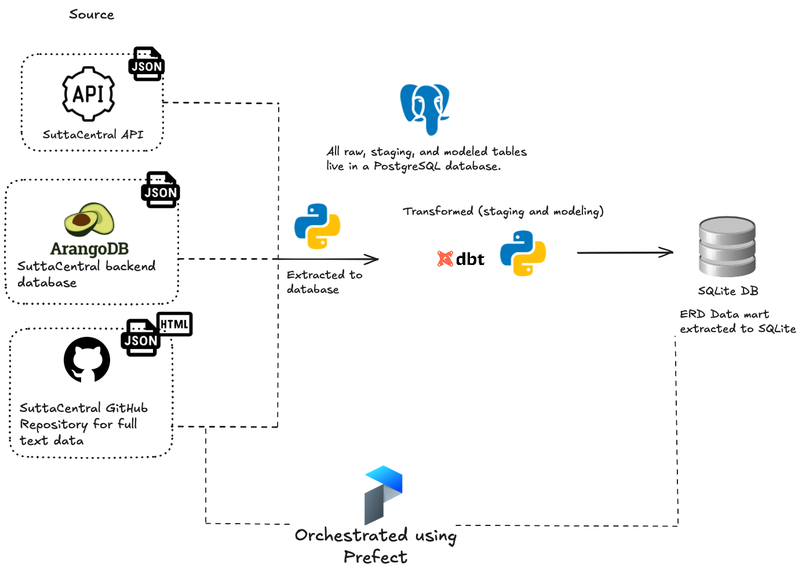

# Pali Canon Database
- [Pali Canon Database](#pali-canon-database)
  - [Introduction](#introduction)
  - [Schema Overview](#schema-overview)
    - [Entity-Relationship Diagram](#entity-relationship-diagram)
      - [Author](#author)
      - [Language](#language)
      - [TextInfo](#textinfo)
      - [Translation](#translation)
  - [Installation and Setup](#installation-and-setup)
  - [Usage](#usage)
    - [Example queries](#example-queries)
  - [Architecture](#architecture)
  - [Future work / To-do](#future-work--to-do)
  - [Contribute](#contribute)

## Introduction

The Pali Canon database is a SQL relational database of the Pali Canon that provides a structural representation of the three baskets:
- **Sutta Piṭaka**
- **Vinaya Piṭaka**
- **Abhidhamma Piṭaka**

By organizing these texts into a relational schema, the database can faciliate research and textual analysis. Scholars and practioners can run complex queries for in-depth exploration of the Pali Canon.

All data is sourced from [SuttaCentral](https://github.com/suttacentral).

## Schema Overview
### Entity-Relationship Diagram


#### Author
- `author_uid`: Unique identifier for each author
- `author_short`: Short name or abbreviation for the author
- `author`: Full name of the author

#### Language

Lists the languages used in the database.

- `lang`: Language code
- `lang_name`: Full name of the language

#### TextInfo

Contains metadata about each text in the Pali Canon. 

- `uid`: Unique identifier for each text
- `parent_uid`: Identifier of the parent text (for hierarchical organization)
- `blurb`: Brief description of the text
- `original_title`: Title in the original language
- `translated_title`: Translated title
- `acronym`: Acronym or short code for the text
- `difficulty`: Indicates the difficulty level of the text
- `basket`: Basket to which the translation belongs to
- `root_lang_name`: Name of the original language
- `root_lang`: Code of the original language
- `type`: Type or category of the text

#### Translation

Contains informations and text content of each translation.

- `translation_id`: Unique identifier for each translation
- `uid`: Identifier of the original text (corresponds to TextInfo.uid)
- `lang`: Language code of the translation (corresponds to Language.lang)
- `author_uid`: Identifier of the translator (corresponds to Author.author_uid)
- `local_file_path`: Path to the translation file
- `basket`: Basket to which the translation belongs to
- `text_context`: The text content of the translation

## Installation and Setup

1. Install the latest version of the Pali Canon database in the [Release section](https://github.com/gyk-jane/pali-canon-db/releases). 
2. Install [DB Browser](https://sqlitebrowser.org/dl/) for easy viewing and access.

## Usage
### Example queries
1. Searching for all occurences of "impermanence" in the text content of English translations:
```sql
SELECT 
   tr.translation_id, 
   tr.uid, 
	ti.parent_uid,
	ti.basket,
   ti.translated_title,
   a.author,
   tr.text_content
FROM 
   Translation AS tr
LEFT JOIN TextInfo ti
   ON tr.uid = ti.uid
LEFT JOIN Author a 
   ON tr.author_uid = a.author_uid
WHERE 
   tr.text_content LIKE '%impermanence%' 
   AND tr.lang = 'en';
```

2. Retrieving the lineage of a text
```sql
WITH RECURSIVE lineage AS (
  SELECT uid, parent_uid, basket
  FROM TextInfo 
  WHERE uid = 'mn11'
  UNION ALL
  SELECT t.uid, t.parent_uid, t.basket
  FROM TextInfo t
  INNER JOIN lineage l ON t.uid = l.parent_uid
)
SELECT GROUP_CONCAT(uid, ' > ') AS lineage, basket
FROM lineage
ORDER BY LENGTH(uid) DESC
LIMIT 1;
```
This query builds the lineage of `mn11` recursively. For example, the output looks like:
| lineage  | basket |
| -------- | -------|
| mn11 > mn-sihanadavagga > mn-mulapannasa > mn > middle  | sutta |

## Architecture


All texts and metadata are sourced from [SuttaCentral](https://github.com/suttacentral), which provides comprehensive access to the Pali Canon.

## Future work / To-do
- [ ] Dockerize project to simplify deployment.
- [ ] Enhance query speed and implement more advanced search capabilities, especially for searching through textual content.

## Contribute
Contributions are welcome! 

- **Issues**: If you have any problems, questions, suggestions for improvement and new features, please open an issue.
- **Pull requests**: Fork the repo and open a pull request to submit contrubitions to the project.
